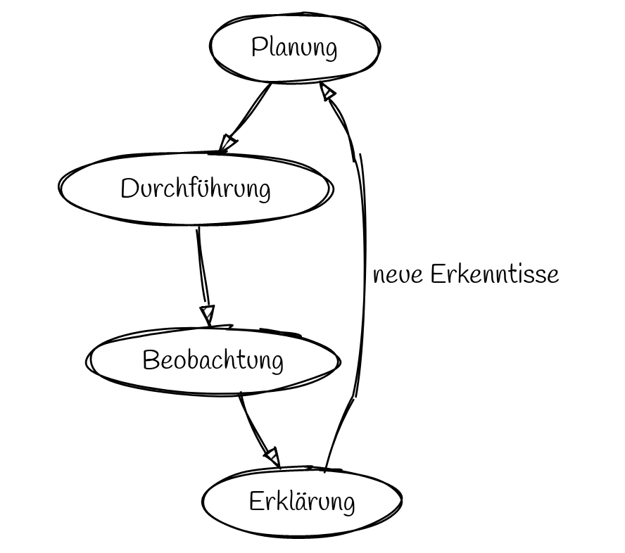

Charakteristische Denk- und Arbeitsweisen in der Physik
=================

## Planung von Experimenten zur Temperaturmessung

- Gleiche Mengen an gefrorenem Wasser und Raumtemperatur mischen
- Kaltes Wasser mit Kochsalz anreichern
- Wasser erhitzen
- Übergang von gefrorenem zu flüssigem Zustand
- ???

> Entwickeln Sie als zufällig zusammengestelltes Paar ein Experiment und stellen Sie zu Beginn eine Zielformulierung auf.

## Protokolle als Medium der Kommunikation

[Anforderungen im Profilkurs](04_Protokolle_Experimente.md)

# Aufgabenstellungen

## Beispiel 1

Ermitteln Sie den Temperaturverlauf beim Tauen von kaltem Wasser unter der Zugabe von Salz. Stellen Sie eine Hypothese auf, weshalb das Wasser unter Zugabe von Kochsalz sich entsprechend der Messwerte verhält.

## Beispiel 2

Erhitzen Sie Wasser von verschiedenen Ausgangstemperaturen aus. Vergleichen Sie die Temperaturverläufe. Stellen Sie eine mathematische Näherung des Temperaturverlaufs für Auffällige Abschnitte der Graphen auf.

## Beispiel 3

Vergleichen Sie das Tauverhalten von Süßwasser mit dem Tauverhalten von Salzwasser. Prüfen Sie den Temperaturverlauf auf Linearität. Untersuchen Sie insbesondere die Zeitabschnitte vor und nach dem Phasenübergang.

## Beispiel 4

Vergleichen Sie das Tauverhalten von Süßwasser mit dem Tauverhalten von Salzwasser. Stellen Sie begründet mathematische Beschreibungen (Regressionsfunktionen bzw. Ausgeleichsgerade/-Kurve) für einzelne Abschnitte des Graphen auf.
