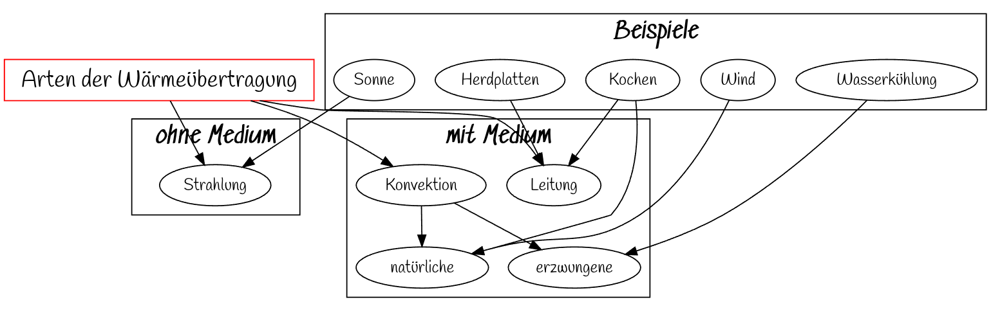
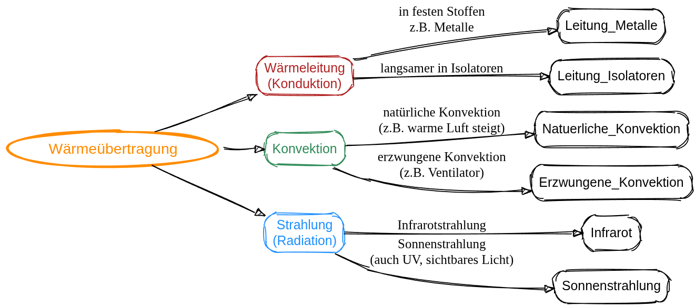

Wärmeübertragung
================

Wir haben folgende Mitschrift erarbeitet:

Dafür wurde die Graphviz-IDE [Sketchviz](https://sketchviz.com/new) verwendet und folgender Code generiert:

~~~dot
digraph G {
  graph [fontname = "Handlee"];
  node [fontname = "Handlee"];
  edge [fontname = "Handlee"];
  
  //layout = neato;

  bgcolor=transparent;

 a [label="Arten der Wärmeübertragung" fontsize=20  shape=cube color=red]
 
 a-> Strahlung;
 a-> Leitung;
 a-> Konvektion;
 
  subgraph cluster_2 {
    Strahlung;
    
    label = "*ohne Medium*";
    fontsize = 20;
 }
 
  subgraph cluster_0 {
    Leitung
    Konvektion -> natürliche
    Konvektion -> erzwungene
    label = "*mit Medium*";
    fontsize = 20;
  }
 
 subgraph cluster_1 {
    Sonne -> Strahlung
    Herdplatten -> Leitung
    Kochen -> Leitung
    Kochen -> natürliche;
    Wind -> natürliche;
    Wasserkühlung -> erzwungene;
    label = "*Beispiele*";
    fontsize = 20;
  }
}

~~~

Die KI hat folgende Grafik erzeugt:

## Kontext Wärmeübertragung

1. Erstellen Sie eine Concept-Map, die die verschiedenen Wärmeübertragungen bei einer modernen Heizungsanlage erklärt.

