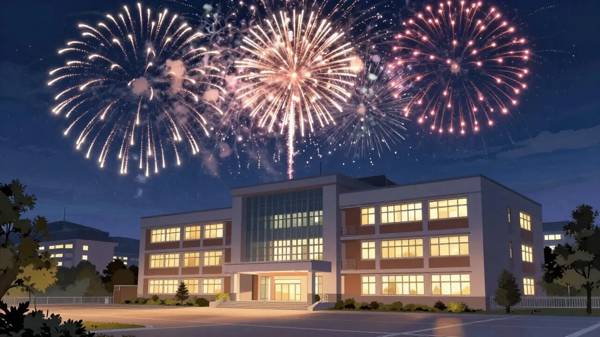

PK Physik 11 2025/2026
======================

In diesem Dokument werden im Verlauf des Jahres diverse Materialien und Aufgaben zusammengestellt, die zum Slebstlernen und Lernen in der Schule geeignet sind.

[toc]

# Erstes Halbjahr

## Woche 01

- [Intro](./00_Intro.slides.md)
- Themenwahl für die ersten Stunden
    - Wünsche aus der Sek I und II
    - Ich will Sie und Ihre Fähigkeiten kennenlernen
- [Aufwärmübungen](./01_Aufgaben_Aufwärmen.md)

### Themen, die Sie sich in Physik wünschen: 

### Wissenswertes über uns

- IT Ausstattung
- Größter Erfolg in Physik
- Hassfach in der Schulzeit
- Physik-Laufbahn
- Lieblingsbereich in der Physik
- Hobbys
- Warum Physik als Fach?
- Welche anderen Fächer spielen eine Rolle?

## Woche 02

- [Aufwärmübungen](./01_Aufgaben_Aufwärmen.md)

## Woche 03

- [Arbeitsauftrag Elektrofahrzeuge](./02_Aufgaben_Elektrofahrzeuge.md)

Falls Sie etwas übersehen haben, nachschlagen wollen oder insgesamt immer schon mal wissen wollten, was Energie eigentlich ist: https://www.heise.de/hintergrund/Energie-Ein-Crash-Kurs-4271946.html

## Woche xx (nach den Herbstferien)

1. Einer aus jeder Gruppe präsentiert den aktuellen Entwurf einer anderen Gruppe.
    - Teilgruppe: Todo-Liste (schriftlich), Feedback (mündlich)
2. Arbeitszeit
3. Vorlage beim Lehrer (freiwillig)

## Woche xx+01

- Der englischsprachige Blog https://betterposters.blogspot.com/ enthält eine [Vorbereitung auf einen Postertalk](https://betterposters.blogspot.com/).

> In that conference, flash talks for posters should be at most 2:30 minutes, and had to be pre-recorded.
>
> und
> 
> It took me a couple of tries to get it short. It is much more difficult than in person, but I think this is the same lesson I have learned teaching remote classes this year and organising remote meetings and supervision. 
>
> Quelle: https://betterposters.blogspot.com/

- 30 Minuten voller Poster-Talks: https://www.youtube.com/watch?v=WWHbe1nfChA

### Ablauf der Doppelstunde

- 20 Minuten Vorbereitungszeit
- 4 x 3 Minuten pro Talk
- Feedbackrunde
- Notenbestimmung

Und weil womöglich noch Zeit ist:

- Unterschied zwischen Energie, Arbeit und Leistung
- Energieumwandlungskette für den eDumper
- Energieumwandlungskette eines ÖPNV-Busses mit Klima-Anlage
- Energieumwandlungskette einer Straßenbahn mit Klima-Anlage
- Definition des Wirkungsgrades, Beispielrechnungen

# Off Topic aber wichtig

## Studienfahrt

> Werbung!

## Klausur am 01.12.2025

> [Operatoren](../../../Operatoren_IQB_2025.md): Erläutern, Beschreiben, Skizzieren, Berechnen, Begründen

> Thema: Energie, Energieformen und -Umwandlung
> - Energie, Arbeit, Leistung
> - Energieumwandlungsketten
> - Wirkungsgrad
> - Kraftumformende Einrichtungen: Flaschen-/Seilzug

# Messwerterfassungssystem

## Woche vom 08.12.

- Nachbesprechung Klausur
- Blick auf [Abituraufgaben](https://www.isq.berlin/wordpress/pruefungsarbeiten/berlin_zentralabitur/#1523966044400-d7c2f1c1-e34d)
- [Aufgabenstellug und Material](./03_Messwerterfassungssystem.md)

# 2026

## Rückblick

> Review: Was war das letzte vor den Ferien? Was bleibt zu tun? Es gibt eine grafische Darstellung in jedem Hefter?

### Neue Aufgabenstellung

- Vergleichen Sie die Temperaturverlaufskurven von schmelzendem Schnee, wenn Sie die selbe Menge ungestört tauen lassen oder gleichzeitig mit einem Gebläse verschiedene Zonen des Gefäßes belüften.
- Erstellen Sie zunächst pro Arbeitsgruppe eine Planung mit Skizze, Teileliste und einer Hypothese über die Ergebnisse.

# Basiskonzepte

- Lesen Sie das Kapitel Basiskonzepte ab S. 18 (bzw. 19) in [Bildungsstandards im
Fach Physik für die
Allgemeine Hochschulreife](https://www.kmk.org/fileadmin/veroeffentlichungen_beschluesse/2020/2020_06_18-BildungsstandardsAHR_Physik.pdf)
- Nennen Sie pro Basiskonzept jeweils ein Beispiel aus Ihrem bisherigen Physikunterricht (ohne das letzte Experiment zum Schmelzen von Schnee - der eDumper ist aber erlaubt).
- Entwerfen Sie eine griffige Definition für jedes Basiskonzept
- Erstellen Sie eine Tabelle in der Sie **alle** Basiskonzepte auf das Experiment mit dem Schmelzen von Schnee anwenden

<!--

## Fachprojektwoche

[Arbeitsauftrag und Ziele](03_Fachprojektwoche.md)

## Woche nach den Winterferien

[Charakteristische Denk- und Arbeitsweisen in der Physik](04_Methoden_Physik.md)

## Woche zwei, drei vier

- Eigene Protokolle zu Experimenten
- Einstieg in Thermodynamik
- Funktionsweise Kühlschränke oder Wärmepumpe
- Planung von Experimenten zur Untersuchung der Abkühlungsvorgänge eines Körpers

## Nach den Osterferien

### Interpretation von IR-Bildern

> Recherchieren Sie ein IR-Bild und präsentieren Sie dieses dem Kurs. Erläutern Sie die physikalischen Hintergründe zu den besonders interessanten Stellen im Bild.

### Anwendungsgebiete von IR Licht erläutern

> Der Wikipediaartikel zum Thema Infrarotstrahlung listet 13 Anwendungsgebiete auf. Erläutern Sie zwei dieser Anwendungsgebiete. Beurteilen Sie begründet den persönlichen Nutzen für Sie und genauso den Nutzen für die Gesellschaft im Allgemeinen.

Schriftliche Arbeit mit Vergleich.

-->

Have a lot of fun!
