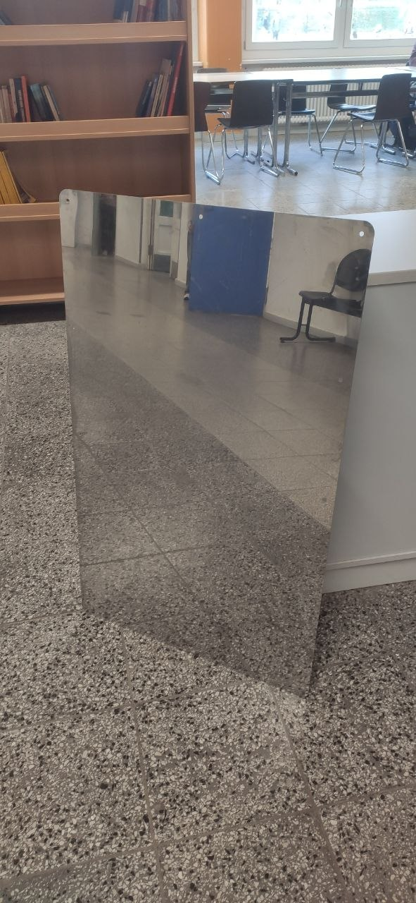
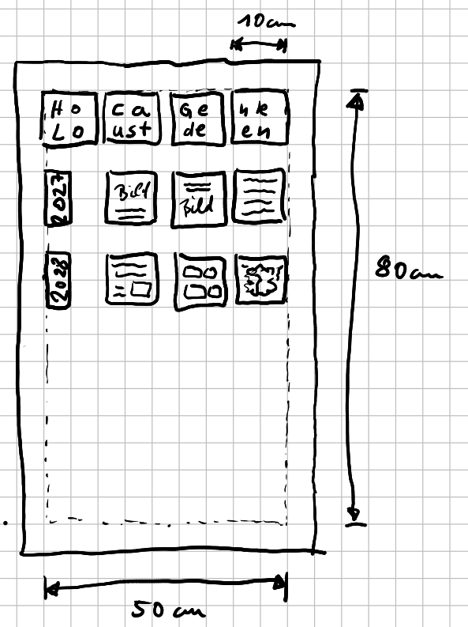
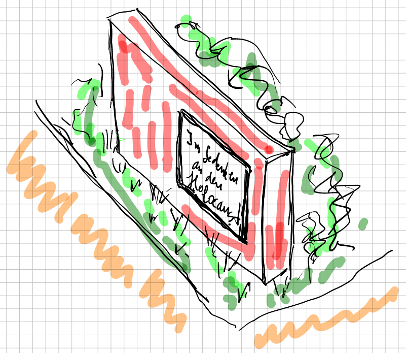

Holocaust-Gedenken
============

## Zielstellung

Es sollen zwei Orte geschaffen werden, die das aktive Gedenken und die Auseinandersetzung mit dem Holocaust fördern.

1. Ein Ort der öffentlich sichtbar ist, bei dem das Design darauf ausgelegt ist, dass es gelegentlich, je nach gesellschaftlicher Entwicklung, repariert werden muss. Dieser Gedenkort soll und darf verwittern, damit er gelegentlich von den jeweils aktuellen Schülergenerationen saniert werden kann. Er soll robust gegen Vandalismus sein.
1. Ein der Schulgemeinschaft vorbehaltener Ort darf künstlerisch aufwendiger gestaltet sein. Er muss nicht so robust sein. Allerdings soll er ausdrücklich regelmäßig (jährlich) weiterentwickelt und gestaltet werden können.

## Ideen zur Umsetzung

### Gedenktafel für die Schulgemeinschaft

Uns steht eine polierte Metalltafel zur Verfügung, die sich mit einem Lasergravurgerät relativ leicht in eine hochwertige Tafel verwandeln lässt.

Das Lasern verursacht keine Kosten, da ich über ein solches Gerät verfüge.

> Schülerinnen und Schüler dürfen drei Quadrate von ca. 10cm x 10cm frei gestalten. Vermutlich ist eine einfarbige Gestaltung ohne Graustufen am Effektivsten. Die Gestaltung der Quadrate kann mit Stift und Papier oder als digitale Grafik vorgenommen werden.

Das grundsätzliche Layout könnte prinzipiell folgendermaßen aussehen:

### Gedenkort öffentlich

Folgende Überlegungen erscheinen als Anforderungen an das Design denkbar:

- Ein Rahmen auf einer Mauer, der fest verankert ist, schützt eine innen liegende Gedenktafel
- Die Gestaltung sollte als Relief gestaltet sein, damit das wahrscheinlich Beschmieren mit Lack als einfachste Form des Vandalismus nicht die Inhalte stören kann
- Die Gedenktafel ist aus mehreren Segementen zusammen gesetzt, damit sie einzeln oder insgesamt leicht zu wechseln sind
- Ein Segment sollte mit schulischen Mitteln herstellbar sein, denkbar sind Fliesen aus:
    - Holz (Schnitzerei oder Fräsarbeit)
    - Ton (Getöpfert und gebrannt)
    - PLA (umweltstabiles aber biologisch abbaubarer Kunststoff mit einem 3D-Drucker gefertigt)
- Die Segmente können und sollten gut mit Fliesenkleber oder Silikon in den äußeren Rahmen einzukleben sein

## Beteiligte

- Beratung: Erweiterte Schulleitung, ggf. GSV
- Beschlüsse: Schulkonferenz
- Erstellung: Jeder Mensch aus Schulgemeinschaft kann einen Beitrag leisten
- Jury: Auswahl der drei Quadrate für 2027

## Zeitplan

| Zeitraum | Aktivität |
|---|---|
| Schuljahr 2025/2026 bis zu den Sommerferein | Konkretisierung der Planung und Festlegen von Orten und Beteiligten |
| August 2026 bis 27.01.2027 | Herstellung des "internen" Gedenkortes |
| 27.01.2027 | Feierliche Einweihung und gemeinsames Gedenken am Holocaust-Gedenktag |
| Schuljahr 2027 bis Sommerferien | Planung des öffentlichen Gedenkortes mit den Erfahrungen aus dem ersten Teilprojekt |
