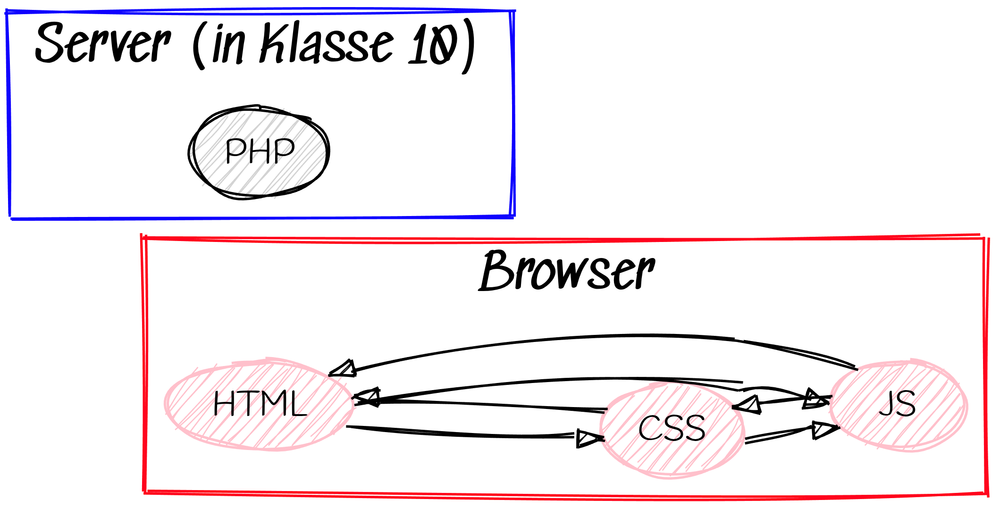

WPU 9 Informatik
===========

# Orga

> Wir sehen uns nur noch zwei Stunden pro Woche!

## Belehrungen

* [Regeln im NAWI-Fachraum](../../../Fachraumordnung_und_Experimentierregeln_SuS.pdf)
* [Regeln im Computerraum](../../../Regeln_Computerraum_2025-09-10.pdf)
* [Unterschriften](../../../Unterschriftenliste_Sicherheitsunterweisung_GCM_SuS.pdf)
* [Operatoren](../../../Operatoren_IQB_2025.md)
* [Kriterien für die mündliche Bewertung](../../../Kriterien_mündlich_SEK-I.md)

## Wichtige Tools

# Webentwicklung

> Dritte jetzt neue Technologie: JavaScript

# Spielen in PHP

https://www.programiz.com/php/online-compiler/

## Aufgaben

1. Erstelle ein Hello World.
1. Erstelle ein Programm, das eine Webseite ausgibt (Boilerplate genügt).
1. Die Webseite soll die Uhrzeit zum Zeitpunkt des Renderns ausgeben.
1. Die Webseite soll eine zufällige Anzahl an Uhren anzeigen, wobei die Zahl zwischen 1 und 100 liegen soll. Jede Uhr ist in einem eigenen DIV-Tag und hat eine eigene Hintergrundfarbe, die per inline-CSS gestaltet ist.

> Sende am Ende der Stunde den von Dir generierten Code per Mail.

### Code-Snippets

#### Uhrzeit bestimmen

~~~php
date_default_timezone_set("Europe/Berlin");
$timestamp = time();
$datum = date("d.m.Y",$timestamp);
$uhrzeit = date("H:i",$timestamp);
echo $datum," - ",$uhrzeit," Uhr";
~~~

# Einen eigenen Server betreiben

https://bplaced.net

* Upload des eigenen Codes per FTP
