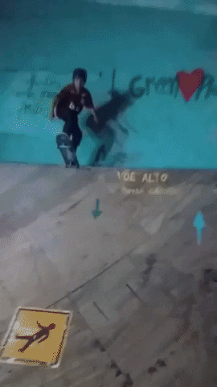

## Ein Spiel

* 5 Minuten Zeit
* Für jeden Buchstaben im Alphabet einen Begriff finden

> Thema: **Bewegung**

---

~~~ markdown
# Bewegung A-Z

Antrieb Auto Anlaufen Autoreifen Arbeit
Bewegung Benzin Beschleunigung
Chamäleon Chemische_Energie Countdown
Drohne Durchschnitt Durchschnittsgeschwindigkeit Drache Dampf
Elektrizität Energie Eislaufen Elefant/Ente Elektronen Einheit
Farenheit Fortbewegung Fahren Flugzeug Fußball Fahrlässigkeit Falke Flügel
Gehen Geschwindigkeit Geschlechtsverkehr Geisterbahn Gleise Gabelstapler
Hebel Halten Hampelmann Handball Helikopterrotorblatt Harpune Hüpfen
Intervalltraining Internet
Joggen Jaguar Jagen
~~~

---

## Bewegungen beschreiben

### Sozusagen Partnerarbeit

1. Skizziere einen Vorgang, bei dem sich etwas bewegt.
2. Tausche die Skizze mit einem Nachbarn.
3. Beschreibe die Bewegung mit eigenen Worten.
4. ~~Notiere die entscheidenden Adjektive.~~

### Sozusagen Tafelbild -> Hier STOPP

> ~~Strukturvorschlag: Ortsverlauf, Geschwindigkeitsverlauf~~

---

<iframe width="560" height="315" src="https://www.youtube.com/embed/vjDYMSMNn0A" title="YouTube video player" frameborder="0" allow="accelerometer; autoplay; clipboard-write; encrypted-media; gyroscope; picture-in-picture; web-share" referrerpolicy="strict-origin-when-cross-origin" allowfullscreen></iframe>

---

## Bewegungen beschreiben

> Beschreibe die Bewegung mit eigenen Worten.

---

## Bewegungen beschreiben

Skateboarding im Klassenzimmer...

> Beschreibe die Bewegung mit eigenen Worten.
> Notiere die entscheidenden Adjektive.

---

## Übung: Form erkennen

> Begründe, welches der Beispiele nicht zu den Anderen passt.

- Schuss auf ein Tor
- Ohne Hände Rad fahren
- Bogenschießen auf lange Distanz
- Etwas fallen lassen
- Bogenschießen auf kurze Distanz

> Stelle eine Vermutung auf, welche Bewegungsform hauptsächlich gemeint ist.

---

## Übung: Form erkennen

> Begründe, welches der Beispiele nicht zu den Anderen passt.

- Bogenschießen auf lange Distanz
- Volleyball über ein Netz pritschen
- Feuer mit einem Wasserstrahl löschen
- Mit einem Laserpointer eine Katze locken
- Links abbiegen

> Stelle eine Vermutung auf, welche Bewegungsform hauptsächlich gemeint ist.

---

## BTW

---

## Übung: Arten erkennen

> Begründe, welche der Beispiele...

mit dem Fahrrad...
- in der Ebene rollen lassen
- einen Berg hinauf fahren
- aus einem Flugzeug springen
- anhalten
- an der Ampel auf grün warten

> Stelle eine Vermutung auf, welche Bewegungsart hauptsächlich gemeint ist.

---

## Übung: Arten erkennen

> Begründe, welche der Beispiele...

im Riesenrad...
- warten, dass es endlich losgeht
- schreien, wenn man ganz oben stehen bleibt
- schaukeln
- die Freundin allein lassen
- immer im Kreis fahren

> Stelle eine Vermutung auf, welche Bewegungsart hauptsächlich gemeint ist.

---

---

## Tafelbild und Mitschrift

Hier müssen wir irgendwie Zusammenhänge herstellen!

- Bewegungsformen
- Bewegungsarten
- Geschwindigkeit
- Kräfte (Skateboard)

