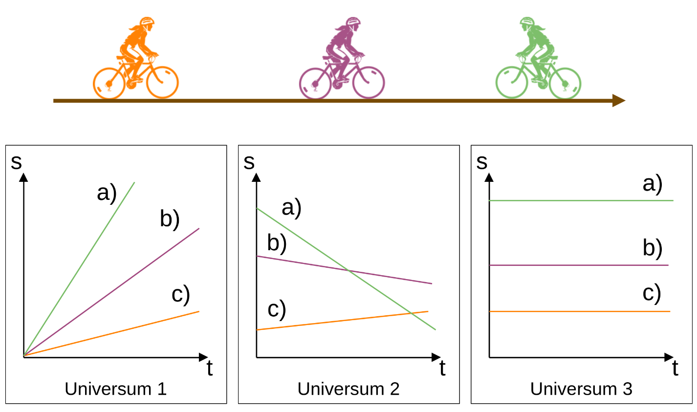
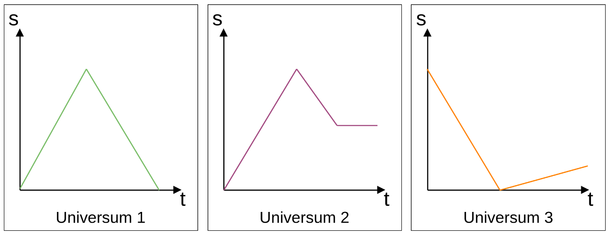
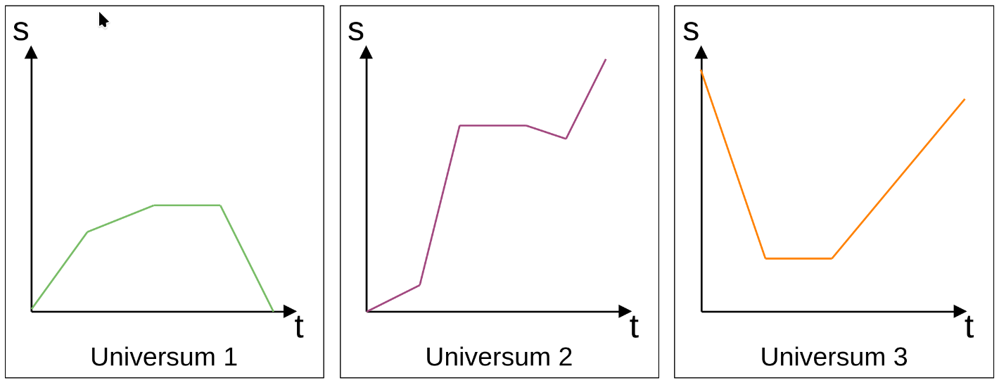
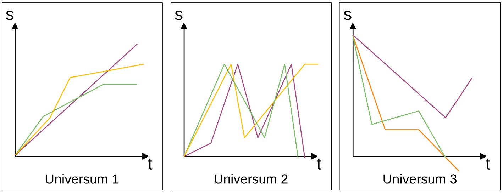

### Bewegungen darstellen

- s(t)-Diagramm
- Fiffi
- verschiedene gleichförmige Bewegungen

---

# Test

---

# Feedback Klassenrat

- Kleine Denkanstöße
- Strengere Mitarbeitsbewertung 
- Einfachere Arbeitsaufträge
    - Arbeitsaufträge erklären 
- Ruhiges Umfeld 
- Kleine Pausen 
- Musik erlauben 
- Mehr mündliche Abfragungen 
- Verschiedene Schwierigkeitslevel

---

### Bewegungen grafisch darstellen

---

> **Interpretiere** das Diagramm und **beschreibe** die Bewegung.

---

#### Bewegungen grafisch darstellen und Graphen interpretieren

> Übernimm die Graphen in Deinen Hefter und ergänze zu jedem Universum in Stichworten die Interpretation.

---

#### Bewegungen grafisch darstellen und Graphen interpretieren

> Übernimm die Graphen in Deinen Hefter und ergänze zu jedem Universum in Stichworten die Interpretation.

---

#### HAUSAUFGABE

> Übernimm die Graphen in Deinen Hefter und ergänze zu jedem Universum in Stichworten die Interpretation.

---

#### Bewegungen grafisch darstellen und Graphen interpretieren

> Übernimm die Graphen in Deinen Hefter und ergänze zu jedem Universum in Stichworten die Interpretation.

---

#### Graphen erstellen

Erstelle zu folgenden Szenarien jeweils eine grafische Darstellung.

> Ein Mensch läuft mit konstanter Geschwindigkeit in eine Richtung und fährt anschließend ebenfalls konstant mit einem Fahrrad in die gleiche Richtung.

> Ein Schnecke überquert mit maximaler Geschwindigkeit eine Straße. Auf der anderen Seite wartet eine andere Schnecke auf sie.

---

#### Graphen erstellen

Erstelle zu folgendem Szenario eine grafische Darstellung:

---

#### off topic

---

#### off topic

---

#### Geschwindigkeiten bestimmen

> Wir ergänzen hier Zahlenwerte und berechnen die Geschwindigkeit.

---

#### Geschwindigkeiten bestimmen

---

#### Geschwindigkeiten bestimmen

---

| ⚠️ **Definitionen** |
|---|
| **Ortsänderung (kinematisch):** Ein Körper befindet sich in Bewegung, wenn sich sein Ort mit der Zeit ändert. |
| **Geschwindigkeit ungleich null:** Ein Körper ist in Bewegung, wenn er eine von Null verschiedene Geschwindigkeit besitzt: $\|{v}\| > 0$.
|**Lageänderung relativ zu einem Bezugssystem:** Ein Körper ist in Bewegung, wenn sich seine Lage relativ zu einem gewählten Bezugskörper, einem anderen Ort bzw. Bezugssystem mit der Zeit ändert. |

---

### Einfache Bewegungen berechnen

$$ Geschwindigkeit = {Weg \over Zeit} $$

$$ v = { s \over t }$$

$$ t = { s \over v }$$

$$ s = { v \cdot t }$$

---

### Gleichförmige Bewegung (E-Scooter)
Mara fährt mit ihrem E-Scooter durch die Stadt mit einer konstanten Geschwindigkeit von \\( v = 20 \text{ km/h}\\). Berechne die Strecke, die  sie in \\( t = 20 \text{ Minuten} \\) zurücklegt.

> Tafelbild

---

### Durchschnittsgeschwindigkeit (Buslinie)
Die Buslinie 47 verbindet den Bahnhofsvorplatz mit dem Stadtzentrum. Die Strecke ist \\(12 \text{ km}\\) lang. Der Bus startet um 7:15 Uhr und erreicht das Zentrum um 7:48 Uhr.
- Berechne, wie lange der Bus unterwegs ist.
- Bestimme seine Durchschnittsgeschwindigkeit in \\(\text{km/h} \\).

> Partnerarbeit

---

### Gleichförmige Bewegung (Lichtsignal)
Ein Laserimpuls wird von einer Station auf der Erde zur ISS (Orbithöhe ca. \\( 408 \text{ km}\\)) gesendet. Das Licht bewegt sich mit \\(v = 300000 \text{ km/s}\\).
- Ermittle die Dauer des Hinwegs des Signals.
- Bestimme die Zeit bis das Signal reflektiert zur Erde zurückkommt (Hin- und Rückweg).

> Einzelarbeit

---

### Gleichförmige Bewegung (Satellit)

Ein künstlicher Satellit umkreist die Erde mit einer durchschnittlichen Geschwindigkeit von 
\\(v=28000 km/h\\).
- Berechne, welchen Weg der Satellit in einer Stunde zurück legt.

> Einzelarbeit
