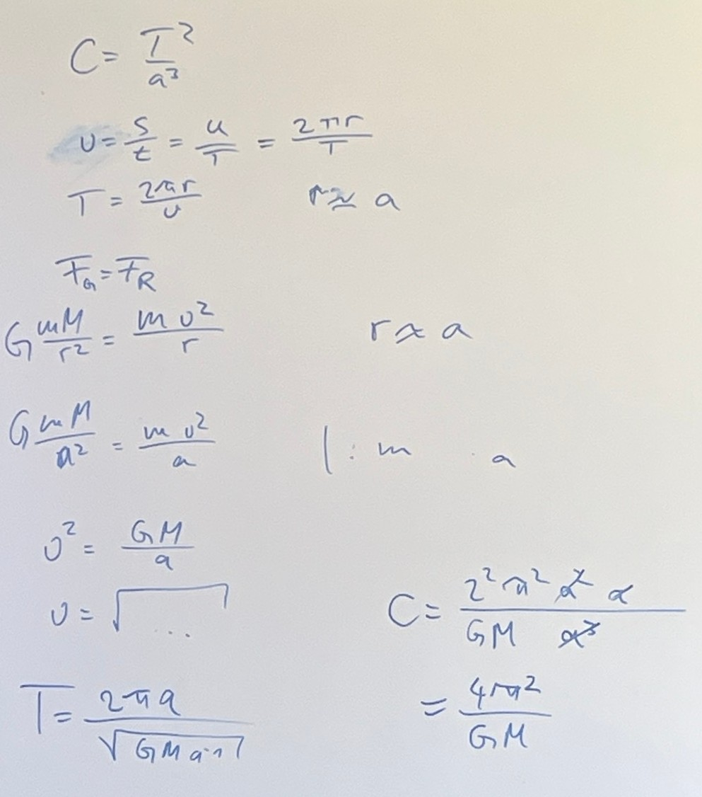

# Kepler Abschluss

## Die Kepler-Konstante

$$ C = {{T^2} \over {a^3}}$$

### Aufgaben

1. Bestimmen Sie die Kepler-Konstante für die Sonne, die Erde und den Jupiter. Bestimmen Sie außerdem das Mars-Jahr. Verwenden Sie folgende Quellen:
    - https://de.wikipedia.org/wiki/Liste_der_Jupitermonde
    - https://de.wikipedia.org/wiki/Liste_der_gr%C3%B6%C3%9Ften_Objekte_im_Sonnensystem
    - https://de.wikipedia.org/wiki/Mond
1. Zeigen sie, dass außerdem gilt \\( C = {{4 \pi^2} \over {G (M + m)}} \\) oder \\( C = {{4 \pi^2} \over {G (M)}} \\)(Wenn Sie keine Idee haben, holen Sie sich Tipps.)

### Lösungen 

#### zu 1.

\\( C_{Sonne} = 2,97 \cdot 10^{-19} {s^2 \over m^3} \\)

\\( C_{Erde} = 9,91 \cdot 10^{-14} {s^2 \over m^3} \\)

oder 

\\(C_{Erde} = 9,81 \cdot 10^{-14} {s^2 \over m^3}\\)

\\( C_{Jupiter} = 3,1 \cdot 10^{-16} {s^2 \over m^3} \\)

\\(T_{Mars} \approx 687 d\\)

#### zu 2.

## Exkurs: Theia, die Quelle des Wassers auf der Erde und andere Theorien

- https://www.mps.mpg.de/theia-und-erde-waren-nachbarn
- https://www.geo.de/wissen/weltall/forschende-entdecken-reste-von-himmelskoerper-theia-im-erdmantel-33962982.html

> Stellen Sie die verschiedenen Theorien dar und bewerten Sie diese aus Ihrer Perspektive.
